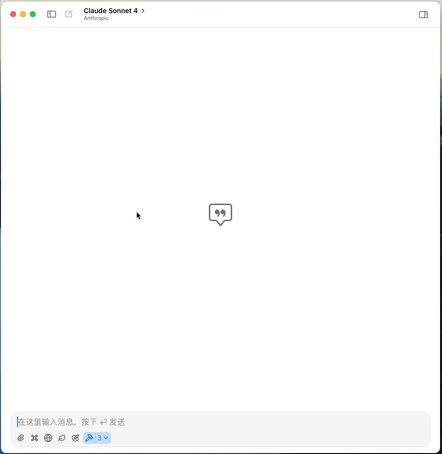
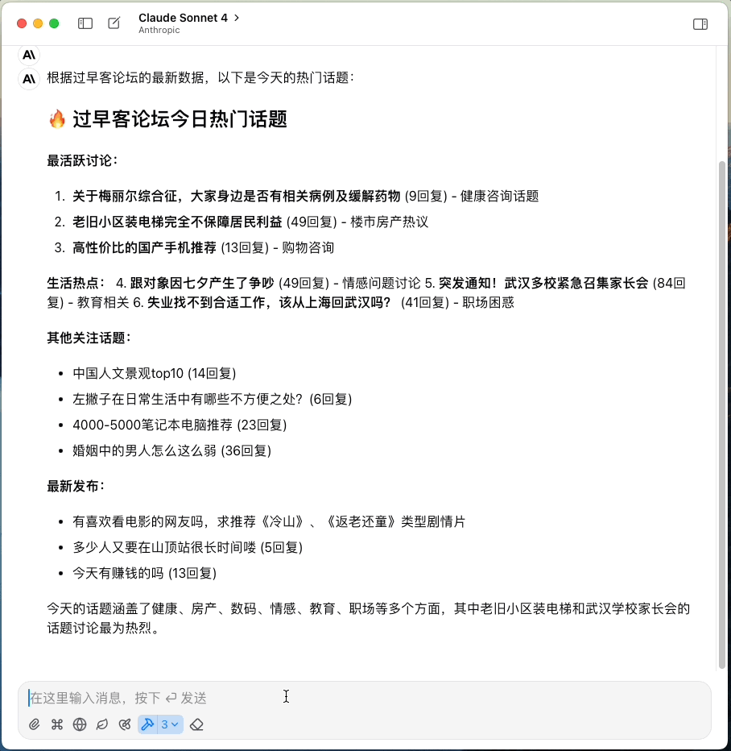

# 过早客 MCP 服务器 (Guozaoke MCP Server)

一个专门用于获取过早客论坛信息的 MCP (Model Context Protocol) 服务器，可以通过 AI 助手访问过早客论坛的话题和内容。

## 效果




## 快速开始

```bash
GUOZAOKE_COOKIE='session=abc123; auth_token=xyz789' npx -y guozaoke-mcp-server
```

or

```json
{
  "mcpServers": {
    "guozaoke-mcp-server": {
      "type": "stdio",
      "command": "npx",
      "args": [
        "-y",
        "guozaoke-mcp-server"
      ],
      "env": {
        "GUOZAOKE_COOKIE": "..."
      }
    }
  }
}
```

## 功能特性

### 工具 (Tools)
- **fetch-guozaoke-topic-list**: 获取过早客论坛话题列表，支持分页浏览。
- **fetch-guozaoke-topic-details**: 根据话题ID获取详细信息，包括内容和回复。支持检测登录状态，支持Cookie认证访问需要权限的内容。

### 提示模板 (Prompts)
- **show-topic-list**: 展示话题列表
- **show-topic-details**: 展示话题详情
